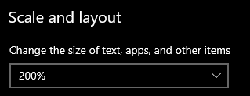
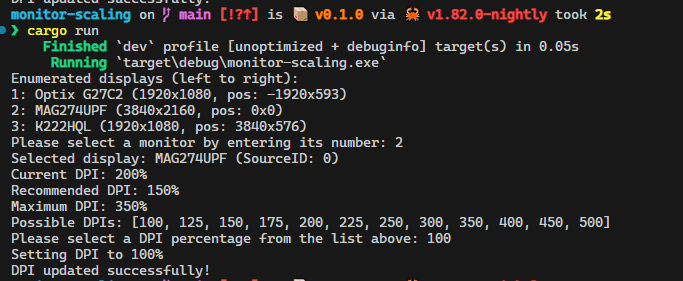
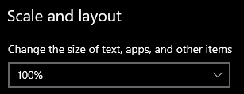

# Monitor DPI Scaling Tool

This repository contains a Rust-based command-line tool for enumerating connected monitors, displaying their resolution and position, and allowing the user to change their DPI scaling settings programmatically. It demonstrates how to leverage undocumented or reverse-engineered Windows APIs to set per-monitor display scaling percentages, mimicking the behavior of the Windows "Display settings" UI.








**Disclaimer:**  
The APIs and techniques used here are not officially documented by Microsoft. They may stop working or change behavior after a future Windows update. 

This code was primarily generated using ChatGPT o1. The tool works, but may not be the best it could be.

Use at your own risk.

## Features

- Enumerates all active displays and sorts them by their screen position (left-to-right).
- Shows each monitor's name, resolution, and offset coordinates.
- Allows the user to select a monitor and a desired DPI scaling value from a predefined set (100%, 125%, 150%, etc.).
- Updates the monitor's DPI scaling value programmatically without requiring a system restart.

## Background and References

This project was inspired and guided by research from several sources, including:

- **StackOverflow Q&A**: Detailed reverse engineering and explanation of the Windows 10 DPI scaling APIs:  
  [*How can I change Windows 10 Display Scaling Programmatically using C#?*](https://stackoverflow.com/a/57397039/11141271)

- **GitHub Repository (C++ sample)**:  
  A publicly available C++ code sample showing how to get and set DPI scaling using undocumented APIs:  
  [windows-DPI-scaling-sample](https://github.com/lihas/windows-DPI-scaling-sample)

  And a derived repo: [SetDPI](https://github.com/imniko/SetDPI)

We took inspiration and parts of logic from these sources and adapted them into a Rust-based implementation. The code in this repository is a Rust port and enhancement of the techniques described above.

## Building and Running

1. **Prerequisites**:
   - Rust toolchain (stable recommended)
   - A Windows 10 or 11 system with Visual Studio Build Tools or the Windows SDK installed.
   
2. **Clone the repository**:
   ```bash
   git clone https://github.com/teamdman/monitor-scaling.git
   cd monitor-scaling
   ```
   
3. **Build**:
   ```bash
   cargo build
   ```
   
4. **Run**:
   ```bash
   cargo run
   ```
   
   The tool will:
   - List all active monitors with their position and resolution.
   - Prompt you to select a monitor by its number.
   - Show you the current, recommended, and possible DPI values.
   - Prompt you to select a DPI percentage from the listed options.
   - Attempt to apply the new DPI scaling setting immediately.

## Notes

- This does not require administrator privileges to run